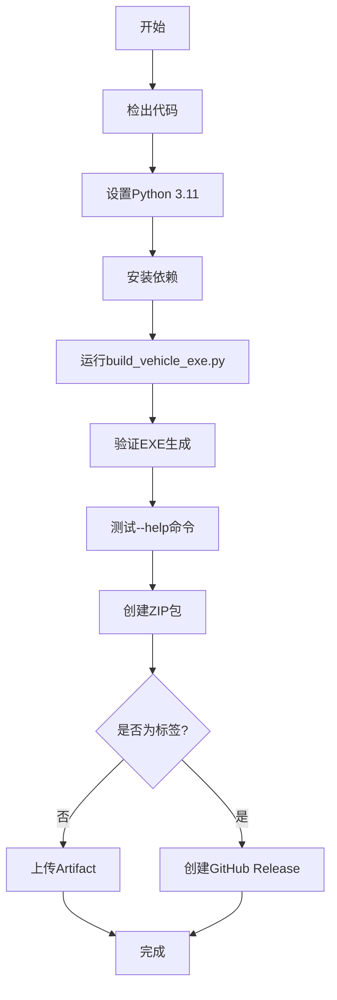

# GitHub Actions 自动构建指南

## 📖 概述

使用GitHub Actions可以自动在Windows环境中构建EXE应用程序，无需本地Windows机器。

## 🚀 快速开始

### 方法1：推送代码自动构建

```bash
# 提交代码并推送到GitHub
git add .
git commit -m "Update vehicle processor"
git push origin main
```

推送后，GitHub Actions会自动：
1. 在Windows虚拟机上运行
2. 安装Python 3.11和依赖
3. 执行 `build_vehicle_exe.py`
4. 打包成ZIP文件
5. 上传为Artifact（可下载）

### 方法2：手动触发构建

1. 访问你的GitHub仓库
2. 点击 **Actions** 选项卡
3. 选择 **Build Vehicle Archive Processor (Windows)**
4. 点击 **Run workflow** 按钮
5. （可选）输入版本号
6. 点击 **Run workflow** 确认

### 方法3：发布正式版本

```bash
# 创建版本标签
git tag -a vehicle-v1.0.0 -m "Release version 1.0.0"
git push origin vehicle-v1.0.0
```

这会自动：
1. 构建Windows EXE
2. 创建GitHub Release
3. 自动上传ZIP包
4. 生成Release说明

## 📁 工作流文件说明

### 文件位置
```
.github/workflows/build-vehicle-windows.yml
```

### 触发条件

| 触发方式 | 说明 | 使用场景 |
|---------|------|---------|
| `push` to main | 推送到main分支 | 开发测试 |
| `pull_request` | 创建PR时 | 代码审查前测试 |
| `workflow_dispatch` | 手动触发 | 按需构建 |
| `tags: vehicle-v*` | 推送版本标签 | 正式发布 |

### 构建流程



## 📥 下载构建产物

### 开发构建（Artifacts）

1. 进入仓库的 **Actions** 页面
2. 选择一个已完成的工作流运行
3. 滚动到底部的 **Artifacts** 区域
4. 下载 `VehicleArchiveProcessor-Windows-buildXXX.zip`

**保留时间**: 30天

### 正式发布（Releases）

1. 进入仓库的 **Releases** 页面
2. 查看最新版本
3. 下载 `VehicleArchiveProcessor-Windows-*.zip`

**永久保存**

## 🔧 自定义配置

### 修改Python版本

```yaml
- name: 🐍 Set up Python
  uses: actions/setup-python@v5
  with:
    python-version: '3.11'  # 改为 '3.10' 或 '3.12'
```

### 修改保留天数

```yaml
- name: 📤 Upload artifact
  uses: actions/upload-artifact@v4
  with:
    retention-days: 30  # 改为 7, 14, 60 等
```

### 添加通知（可选）

在workflow最后添加：

```yaml
- name: 📧 Send notification
  if: always()
  uses: dawidd6/action-send-mail@v3
  with:
    server_address: smtp.gmail.com
    server_port: 587
    username: ${{ secrets.EMAIL_USERNAME }}
    password: ${{ secrets.EMAIL_PASSWORD }}
    subject: Build ${{ job.status }} - VehicleArchiveProcessor
    body: |
      构建结果: ${{ job.status }}
      提交: ${{ github.sha }}
      查看详情: ${{ github.server_url }}/${{ github.repository }}/actions/runs/${{ github.run_id }}
    to: your-email@example.com
    from: GitHub Actions
```

## 🎯 使用场景示例

### 场景1：日常开发测试

```bash
# 修改代码
git add vehicle_info_extractor.py
git commit -m "Fix VIN extraction bug"
git push

# 等待5-10分钟，下载Artifact测试
```

### 场景2：发布Beta版本

```bash
# 创建beta标签
git tag -a vehicle-v1.0.0-beta1 -m "Beta 1"
git push origin vehicle-v1.0.0-beta1

# 自动创建Pre-release
```

### 场景3：正式发布

```bash
# 创建正式版本标签
git tag -a vehicle-v1.0.0 -m "Release 1.0.0

新功能：
- VIN自动提取优化
- Excel标红功能
- 支持登记证类型识别

修复问题：
- 修复车主名称拆分问题
- 修复Excel行号错位
"

git push origin vehicle-v1.0.0

# 检查Release页面，下载分发
```

### 场景4：仅测试不构建完整包

修改workflow，添加缓存：

```yaml
- name: Cache PaddleOCR models
  uses: actions/cache@v3
  with:
    path: ~/.paddleocr
    key: ${{ runner.os }}-paddleocr-${{ hashFiles('requirements.txt') }}
```

## 📊 监控构建状态

### 添加状态徽章到README

在 `README.md` 顶部添加：

```markdown
/badge.svg)
```

效果：
/badge.svg)

### 查看构建日志

1. 进入 **Actions** 页面
2. 点击具体的运行
3. 点击 **build-vehicle-windows** 作业
4. 展开各个步骤查看详细日志

## ⚡ 优化构建速度

### 1. 启用依赖缓存

```yaml
- name: Set up Python
  uses: actions/setup-python@v5
  with:
    python-version: '3.11'
    cache: 'pip'  # ✅ 已启用
```

### 2. 缓存PaddleOCR模型

```yaml
- name: Cache PaddleOCR models
  uses: actions/cache@v3
  with:
    path: |
      ~/.paddleocr
      ~/.paddlehub
    key: ${{ runner.os }}-paddle-models
    restore-keys: |
      ${{ runner.os }}-paddle-
```

### 3. 并行构建多个平台（扩展）

```yaml
strategy:
  matrix:
    os: [windows-latest, ubuntu-latest, macos-latest]
runs-on: ${{ matrix.os }}
```

## 🐛 常见问题

### 问题1: 构建超时

**原因**: 下载PaddleOCR模型耗时
**解决**:
```yaml
- name: Build EXE
  timeout-minutes: 30  # 增加超时时间
```

### 问题2: 依赖安装失败

**错误信息**:
```
✗ OpenCV (未安装)
✗ PDF处理 (未安装)
```

**原因**: 
1. 包名和导入名不匹配（`opencv-python` vs `cv2`, `PyMuPDF` vs `fitz`）
2. 使用了错误的requirements文件
3. pip缓存问题

**解决方案**（已修复）:
- ✅ 使用 `requirements-build.txt` 而不是 `requirements.txt`
- ✅ 修复 `check_dependencies()` 中的包名检查逻辑
- ✅ 添加详细的包验证步骤
- ✅ 升级pip、setuptools和wheel

**手动验证**:
```bash
# 本地测试
pip install -r requirements-build.txt
python -c "import cv2; print(cv2.__version__)"
python -c "import fitz; print(fitz.__version__)"
```

### 问题3: EXE运行报错

**调试方法**:
```yaml
- name: Test EXE with verbose output
  run: |
    cd dist\VehicleArchiveProcessor
    .\VehicleArchiveProcessor.exe --version
    .\VehicleArchiveProcessor.exe --help
```

### 问题4: ZIP包过大（>2GB）

**解决**: 使用轻量级OCR引擎
```bash
# 修改 requirements.txt
# paddleocr  # 注释掉
rapidocr-onnxruntime  # 改用RapidOCR
```

### 问题5: UTF-8编码错误（中文乱码）

**错误信息**:
```
UnicodeEncodeError: 'charmap' codec can't encode characters
```

**原因**: Windows默认使用cp1252编码，无法显示中文

**解决方案**（已内置）:
1. Python脚本添加编码处理（见 `build_vehicle_exe.py`）
2. Workflow配置UTF-8环境变量
3. 使用 `chcp 65001` 设置控制台编码

详细说明见 [UTF8_FIX_GUIDE.md](UTF8_FIX_GUIDE.md)

## 🔐 Secrets配置（可选）

如果需要私有包或通知，添加Secrets：

1. 进入仓库 **Settings** > **Secrets and variables** > **Actions**
2. 点击 **New repository secret**
3. 添加以下secrets:

| Name | 说明 | 使用场景 |
|------|------|---------|
| `PYPI_TOKEN` | PyPI令牌 | 发布到PyPI |
| `EMAIL_PASSWORD` | 邮箱密码 | 构建通知 |
| `SLACK_WEBHOOK` | Slack Webhook | Slack通知 |

## 📈 高级功能

### 矩阵构建（多版本测试）

```yaml
strategy:
  matrix:
    python-version: ['3.9', '3.10', '3.11', '3.12']
runs-on: windows-latest
steps:
  - uses: actions/setup-python@v5
    with:
      python-version: ${{ matrix.python-version }}
```

### 条件构建

```yaml
- name: Build (only on Monday)
  if: github.event.schedule == '0 0 * * 1'
  run: python build_vehicle_exe.py
```

### 定时构建

```yaml
on:
  schedule:
    - cron: '0 0 * * 0'  # 每周日UTC 00:00
```

## 📚 相关文档

- [GitHub Actions文档](https://docs.github.com/actions)
- [actions/setup-python](https://github.com/actions/setup-python)
- [actions/upload-artifact](https://github.com/actions/upload-artifact)
- [softprops/action-gh-release](https://github.com/softprops/action-gh-release)

## ✅ 检查清单

构建前确认：

- [ ] `.github/workflows/build-vehicle-windows.yml` 已提交
- [ ] `build_vehicle_exe.py` 存在且可运行
- [ ] `requirements.txt` 和 `requirements-build.txt` 完整
- [ ] `vehicle_cli.py` 入口文件正确
- [ ] 本地测试通过

发布前确认：

- [ ] 更新 `README.md` 版本信息
- [ ] 创建版本标签（vehicle-vX.Y.Z）
- [ ] 准备Release说明
- [ ] 测试构建产物
- [ ] 更新文档

## 🎉 完成！

现在你可以：

1. **推送代码** → 自动构建测试版
2. **推送标签** → 自动发布正式版
3. **手动触发** → 按需构建
4. **下载Artifact** → 获取构建产物

所有构建都在云端Windows环境中自动完成，无需本地Windows机器！
